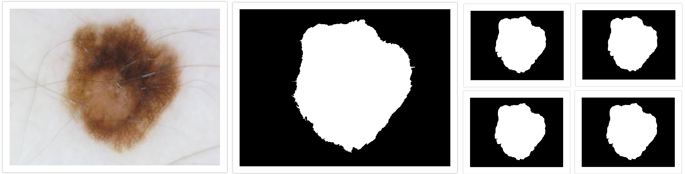
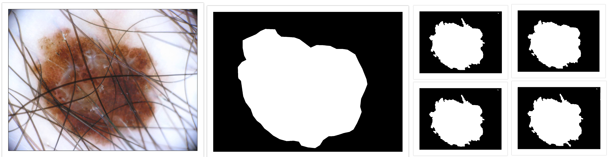
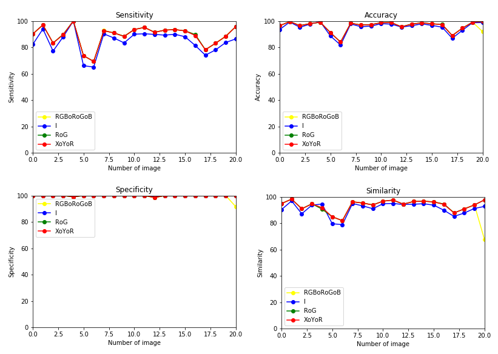

<h1 style="text-align:center"> Skin Lesion Segmentation 
 </h1>

## Motivation 

Melanoma accounts for 3% of new cancer cases. Although it is the most deadly skin cancer (responsible for 60,000 deaths worldwide), early detection can put an end to this tumor. However, this detection remains somewhat difficult in the early stages and accuracy is limited because it resembles common moles. Computer-assisted diagnosis of melanoma provides a quantitative and objective assessment of the skin lesion to support clinicians in this difficult task. A computer-assisted melanoma diagnosis system generally consists of four steps: skin image acquisition, lesion segmentation, feature extraction and lesion classification. The segmentation of skin lesions that we will develop in our project is one of the most important steps in this process.

## Workflow

In order to separate the lesion from normal skin, a segmentation algorithm based on morphological operations, thresholding by histogram, color space transformation has been developed.
Below are the different steps of the segmentation:

- Hair Removal: This step consists of applying the morphological closure to remove the hair.

- Color space Transformation: To overcome the problems of the limitation of the colorimetric space RGB in high level treatments, other colorimetric spaces were developed on the basis of a mathematical transformation of the original RGB color channels.

- Noise Filtering: To reduce calculation time and get better results, it is useful to eliminate artifacts that may be present in the image.

- Intensity adjustement: This step is essentially an enhancement process in which the dynamic range of pixel values in the image is mapped to a new range of values.

- Otsu Threshold: The Otsu Threshold method is used to transform the grayscale image into a binary image.  

- Connected Component Analysis: In some skin images, additional objects appear on the surrounding skin area, such as blue marks made by dermatologists when examining the patient's skin. These objects, which have not been removed during the debridement step, appear with intensity values similar to those of the lesion and may be misclassified as a lesion. The purpose of this step is to exclude these objects from the segmentation output.

## Output 

On the right side we have The orignal lesion image, next to it we have ground truth segmentation ( by dermatologists ) and on the left we have 4 generetated segmentation based on the channels 
(Top left RGBoRoGoB, Top right RoG , Bottom left I, Bottom right XoYoR ) 
- Exemple 1: 

- Exemple 2: 

## Results

The proposed algorithm is applied a set of 32 high-resolution dermoscopy images. The images are 24-bit, RGB images with 8 bits per color channel.
for the evaluation of the detected contours, as the ground truth, manual contours for each lesion were independently drawn by experts (binary images)

The main goal of this analysis is to find the color channels that lead to the most accurate segmentation in the skin lesion segmentation algorithm. 
To achieve this goal, 22 different color channels are extracted from the 32 images, resulting in 22 different segmentation results per image. Each resulting segmentation of 22 × 32, is then compared separately to the manually drawn segmentation (ground truth) in terms of four measures of sensitivity, specificity, precision and similarity. The average of 32 values of each metric yields an average of 25 measures of sensitivity, specificity, accuracy and similarity.
The maximum values of each of these metrics and their corresponding color channels are then identified, resulting in four color channels corresponding to each metric, as shown in the following table, the initial 22 color channels are restricted to the four color channels of :

|Metric|Value|Channel|
:-:|:-:|:-:
Specificity|I|99.95384
Accuracy|RoG|95.72930
Similarity|XoYoR|92.75955
Sensitivity|RGBoRoGoB|87.87214

The figures below show the accuracy, sensitivity, specificity and percentage of similarity of these four color channels on the 32 demoscopy images set, taking the manual segmentation as the ground truth.

